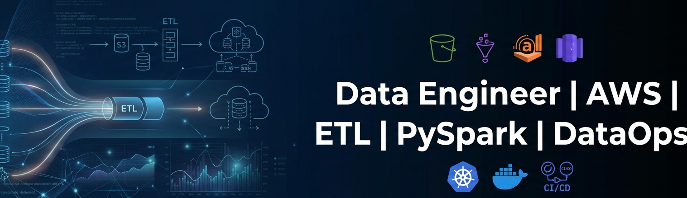

# 🚀 About Me

DevOps & Data Engineer with **5+ years of experience** building scalable cloud platforms, automated CI/CD pipelines, and data-driven systems on AWS.

I specialize in **cloud infrastructure, DevOps automation, and data engineering**, with a strong focus on reliability, scalability, and performance.

With a background in **telecom networking**, I bring deep understanding of **latency optimization, distributed systems, and high-availability architectures**.

---

## 🔍 Current Focus

- AI Infrastructure & MLOps
- Cloud-native data platforms
- Scalable ETL & data pipelines
- Distributed systems resilience
- Platform engineering & automation

---

## ⚙️ Tech Stack

| Category | Tools |
|--------|------|
| Cloud | AWS (EC2, S3, IAM, VPC, Lambda) |
| Containers | Docker, Kubernetes |
| Data Engineering | PySpark, SQL, ETL Pipelines |
| Data Services | AWS Glue, Athena, Redshift |
| IaC | Terraform, CloudFormation |
| CI/CD | Jenkins, GitHub Actions |
| GitOps | ArgoCD |
| Monitoring | Prometheus, Grafana, CloudWatch |
| Scripting | Python, Bash |

---

## 🧠 Architecture & Expertise

✔ Cloud-Native Systems  
✔ Infrastructure as Code (IaC)  
✔ CI/CD & GitOps Pipelines  
✔ Data Pipeline Engineering  
✔ Observability & Monitoring  
✔ AI/ML Infrastructure  

---

## 📦 Featured Projects

### 🔹 AI Cloud-Native Inference Platform
Designed a Kubernetes-based AI inference platform with autoscaling, monitoring, and CI/CD integration for real-time predictions.

---

### 🔹 GitOps Microservices Platform
Implemented a microservices architecture using **Kubernetes + ArgoCD**, enabling automated, version-controlled deployments.

---

### 🔹 DevOps Automation Platform
Built a containerized Flask-based platform integrated with **CI/CD pipelines**, reducing manual deployment efforts and improving release efficiency.

---

### 🔹 AWS Data Pipeline Project
Developed scalable ETL pipelines using **AWS Glue, S3, Athena, and Redshift**, enabling efficient data processing and analytics.

---

## 📊 GitHub Analytics

---

## 🔥 Contribution Activity

---

## 🐍 Contribution Snake

---

## 🌐 Connect With Me

🔗 LinkedIn  
https://linkedin.com/in/avatar-patle-devops-cloud905144226
